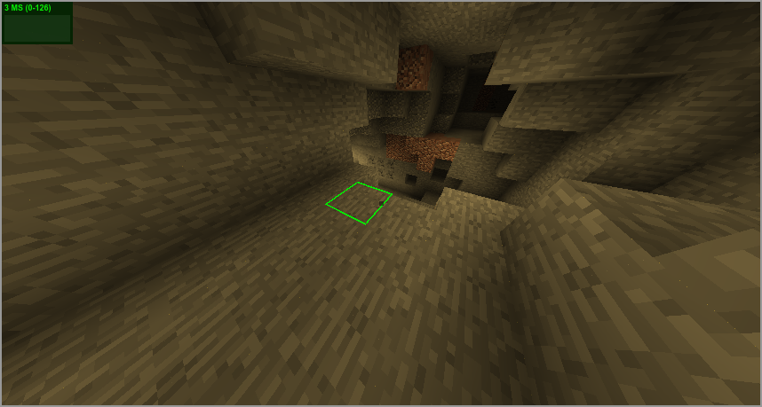

Minecraft.js
===========
...is a minecraft client (with proxy server) in JavaScript using WebGL and Node.js.

Minecraft 1.8.8 is the latest version supported.

Only offline mode works because Minecraft sessions changed a while ago.

To use...
- clone this repo
- `npm install`
- `node server`
- run a Minecraft 1.8.8 server on localhost:25565
- go to [http://localhost:8080](http://localhost:8080)

